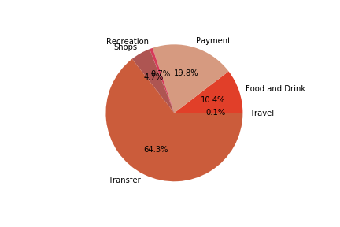
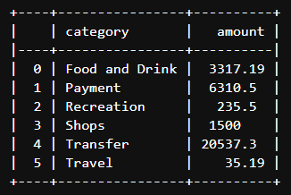
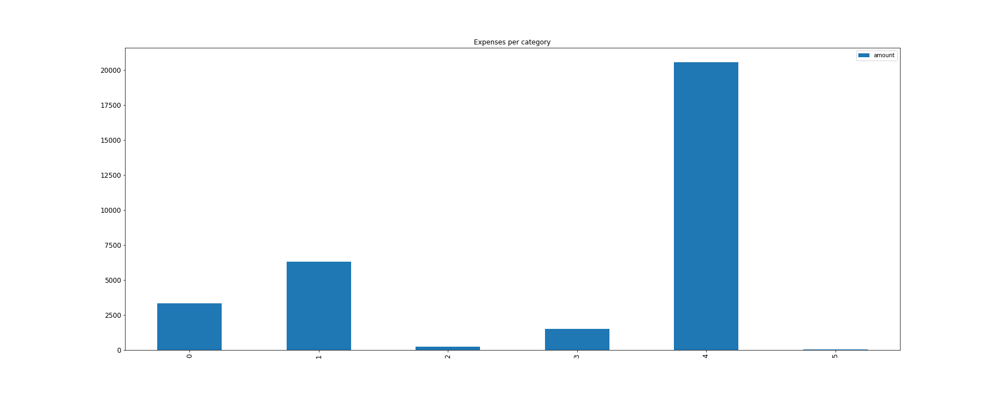
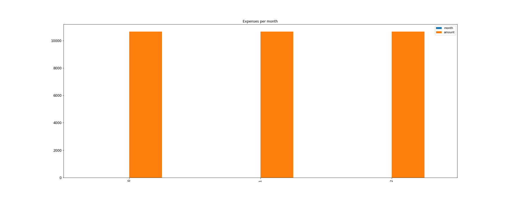
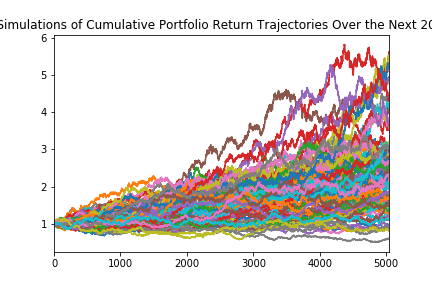
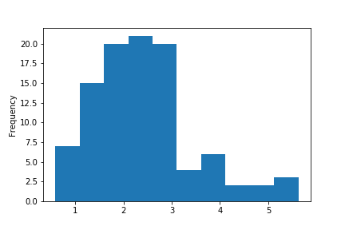
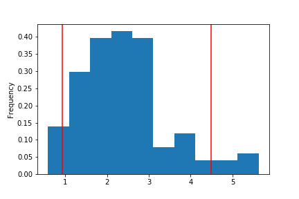

*******************************************************************************
# Budget Analysis: Summarize the transaction data from the budget analysis and include images for each chart and table produced.
*******************************************************************************
* Calculate the total spending per category and print the results (Hint: groupby or count transactions per category)

* Printing results of spending per category

* Generate a bar chart with the number of transactions for each category

* Calulate the expenses per month

* Plot the total expenses per month

******************************************************************************
# Retirement Planning: Summarize the retirement portfolio analysis and include the charts for the Monte Carlo simulation.
*****************************************************************************

### Overview with charts

* Portfolio Cumulative returns

* Ending Cumulative returns

* Probability distribution with confidence intervals

### Retirement Analysis

* What are the expected cumulative returns at 30 years for the 10th, 50th, and 90th percentiles?

The expected cumulative returns at 30 years for the 10th, 50th, and 90th percentiles are 1.2234244997746615 and 2.3086073070947313 and 3.7960223334237115 respectively

* Given an initial investment of $20,000, what is the expected portfolio return in dollars at the 10th, 50th, and 90th percentiles?

The expected cumulative returns at 30 years for the 10th, 50th, and 90th percentiles are 24468.489995493226 and 46172.14614189463 and 75920.44666847422 respectively

* Given the current projected annual income from the Plaid analysis, will a 4% withdraw rate from the retirement portfolio meet or exceed that value at the 10th percentile?

Given the current projected annual income from the Plaid analysis, a 4% withdraw rate from the retirement portfolio will be 978.739599819729 which is be lesser than the projected_years_income:7389

* How would a 50% increase in the initial investment amount affect the 4% retirement withdrawal?

Given the current projected annual income from the Plaid analysis, a 4% withdraw rate from the retirement portfolio will be 1468.1093997295936 which is be lesser than the projected_years_income:7389

