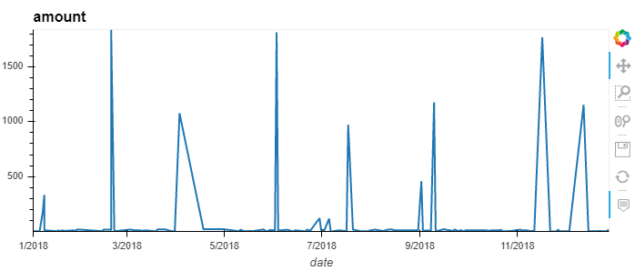
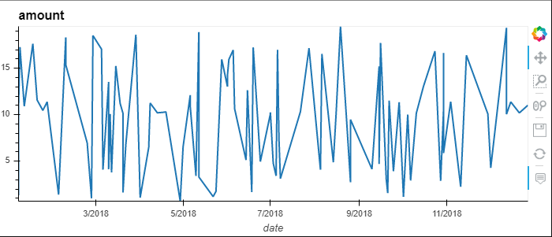

# Credit Card Transactions

1. # Database Schema: Part-01 


2. # Data Analysis: Part-02
* How can you isolate (or group) the transactions of each cardholder?
```sql
SELECT ch."card_name",cc."card_number",t."amount",t."date",m."merchant_name",mc."merchant_category_name" 
  FROM "transactions" AS t
  INNER JOIN "credit_card" AS cc ON t."card_number" = cc."card_number"
  INNER JOIN "card_holder" AS ch ON cc."card_id" = ch."card_id"
  INNER JOIN "merchant" AS m ON t."merchant_id" = m."merchant_id"
  INNER JOIN "merchant_category" AS mc ON mc."merchant_category_id" = m."merchant_category_id"
  ORDER BY ch."card_name" ;
;
```

* Consider the time period 7:00 a.m. to 9:00 a.m.
  * What are the top 100 highest transactions during this time period?
```sql
SELECT CAST(date AS timestamp), amount as "largest_transactions" 
FROM transactions
WHERE date >= '2018-01-01 07:00:00' and date <= '2018-12-31 09:00:00' 
ORDER BY largest_transactions DESC LIMIT 100;
```

  * Do you see any fraudulent or anomalous transactions?
Yes

  * If you answered yes to the previous question, explain why you think there might be         fraudulent transactions during this time frame.
There are a few suspicious activities based on the timing of the transactions from 7-9 early in the morning. 


3. # $2 Fradulent activity: Part-03
Some fraudsters hack a credit card by making several small payments (generally less than $2.00), which are typically ignored by cardholders. Count the transactions that are less than $2.00 per cardholder. Is there any evidence to suggest that a credit card has been hacked? Explain your rationale.

```sql
SELECT ch."card_name", Count(t."transaction_id") AS "Total_Small_Transactions",t."card_number" 
  FROM "transactions" AS t
  INNER JOIN "credit_card" AS cc ON t."card_number" = cc."card_number"
  INNER JOIN "card_holder" AS ch ON cc."card_id" = ch."card_id"
  WHERE t."amount"<2
  GROUP BY t."card_number",ch."card_name"
  ORDER BY "Total_Small_Transactions" DESC;
```
No there dont seem to be any fraudulent activities

4. # Top 5 merchants: Part-04
* What are the top 5 merchants prone to being hacked using small transactions?
```sql
SELECT m."merchant_name" AS "Merchant",mc."merchant_category_name" AS "Merchant Category",Count(t."transaction_id") AS "Total_Small_Trans" 
  FROM "transactions" AS t
  INNER JOIN "merchant" AS m ON m."merchant_id" = t."merchant_id"
  INNER JOIN "merchant_category" mc ON mc."merchant_category_id" = m."merchant_category_id"
  WHERE t."amount"<2
  GROUP BY m."merchant_name",mc."merchant_category_name"
  ORDER BY "Total_Small_Trans" DESC
  LIMIT 5;
```

* Once you have a query that can be reused, create a view for each of the previous queries.
```sql
CREATE VIEW TransactionDetails AS
    SELECT t."transaction_id",t."date",t."amount",m."merchant_name" AS "MerchantName",
            mc."merchant_category_name" AS "MerchantCategory",cc."card_number",ch."card_name" AS "CardHolderName"
    FROM "transactions" t
    INNER JOIN "credit_card" cc ON t."card_number" = cc."card_number"
    INNER JOIN "card_holder" ch ON ch."card_id" = cc."card_id"
    INNER JOIN "merchant" m ON m."merchant_id" = t."merchant_id"
    INNER JOIN "merchant_category" mc ON mc."merchant_category_id" = m."merchant_category_id";
```

```sql
SELECT * FROM transactiondetails ORDER BY "transaction_id";
```

5. # Fradulent activity for important customers: Part-05
* Verify if there are any fraudulent transactions in the history of two of the most important customers of the firm. For privacy reasons, you only know that their cardholders' IDs are 18 and 2.

  * Using hvPlot, create a line plot representing the time series of transactions over the course of the year for each cardholder. In order to compare the patterns of both cardholders, create a line plot containing both lines.







  * What difference do you observe between the consumption patterns? Does the difference suggest a fraudulent transaction? Explain your rationale.

  There is a significant difference in their consumption. In Fig-01 one can see that card holder 18 has spikes of $1000+ whereas card holder 2 in Fig-02 is consistently in the range of $5-$20.

6. # Identify outliers: Part-06

   * Using Plotly Express, create a series of six box plots, one for each month, in order to identify how many outliers per month for cardholder ID 25.


  * Do you notice any anomalies? Describe your observations and conclusions.
Yes there are anomalies as the data points are above the average consumption
