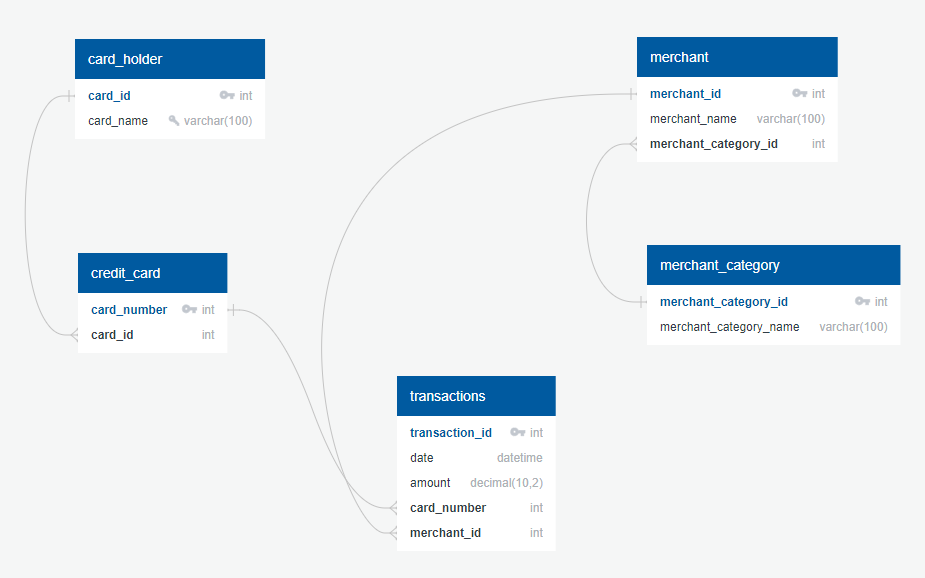

# Credit Card Transactions

1. # Database Schema



2. # Data Analysis Part-01
* How can you isolate (or group) the transactions of each cardholder?
```sql
SELECT card_number, COUNT(card_number) as "transactions per card_number" 
FROM transactions 
GROUP BY card_number;
```


* Consider the time period 7:00 a.m. to 9:00 a.m.
  * What are the top 100 highest transactions during this time period?
```sql
SELECT date_time, amount as "largest transactions from 7-9am" 
FROM transactions 
WHERE CAST(date_time as time) >= '07:00:00' and CAST(date_time as time) <= '09:00:00' 
ORDER BY amount DESC LIMIT 100;
```

  * Do you see any fraudulent or anomalous transactions?
```sql
TBD
```

  * If you answered yes to the previous question, explain why you think there might be         fraudulent transactions during this time frame.


2. # Data Analysis Part-02
* What are the top 5 merchants prone to being hacked using small transactions?
```sql
TBD
```

* Once you have a query that can be reused, create a view for each of the previous queries.

3. # Data Analysis Part-03
* Verify if there are any fraudulent transactions in the history of two of the most important customers of the firm. For privacy reasons, you only know that their cardholders' IDs are 18 and 2.

  * Using hvPlot, create a line plot representing the time series of transactions over the course of the year for each cardholder. In order to compare the patterns of both cardholders, create a line plot containing both lines.
```sql
TBD
```


  * What difference do you observe between the consumption patterns? Does the difference suggest a fraudulent transaction? Explain your rationale.
```sql
TBD
```


4. # Data Analysis Part-04

   * Using Plotly Express, create a series of six box plots, one for each month, in order to identify how many outliers per month for cardholder ID 25.
```sql
TBD
```

  * Do you notice any anomalies? Describe your observations and conclusions.


5. # Data Analysis Part-05
## Challenge

Another approach to identify fraudulent transactions is to look for outliers in the data. Standard deviation or quartiles are often used to detect outliers.

Read the following articles on outliers detection, and then code a function using Python to identify anomalies for any cardholder.