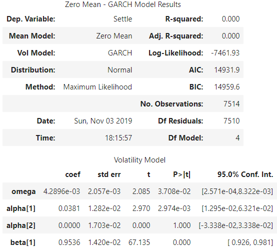

# TIME SERIES FORECASTING
## Based on your time series analysis, would you buy the yen now?
* TBD

## Is the risk of the yen expected to increase or decrease?
* TBD

## Based on the model evaluation, would you feel confident in using these models for trading?
* In the model summaries I would not feel confident in using these models for trading

 

# REGRESSION MODELING
## Does this model perform better or worse on out-of-sample data compared to in-sample data?
* The model works better on out of sample data. Lower the MSE or RMSE better is our model fit or estimator of prediciton. Below are the RMSE for both models:
    - Out-of-Sample Root Mean Squared Error (RMSE): 0.4152158107228894 
    - In-sample Root Mean Squared Error (RMSE): 0.5661029233587197
